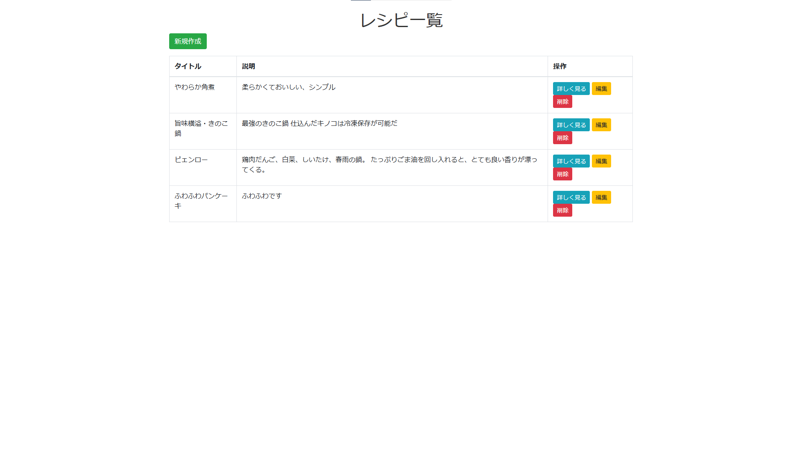
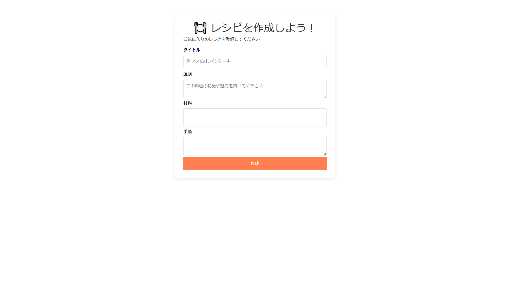
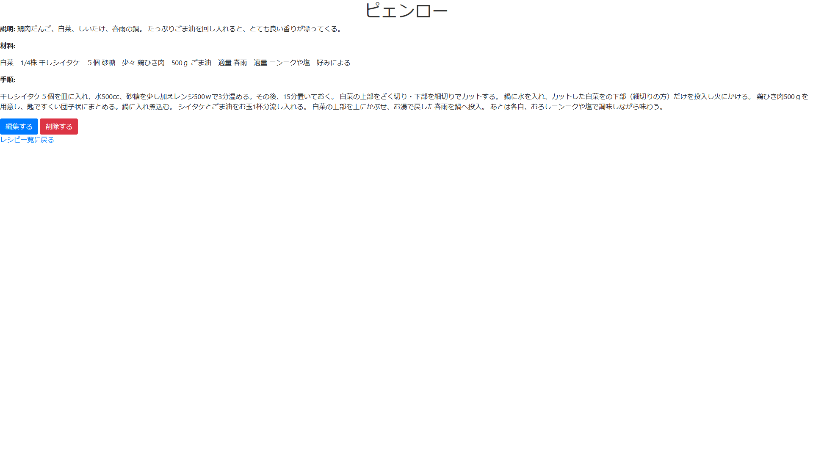

# レシピ作成アプリ

このアプリは、自分のお気に入りのレシピを登録・編集・削除できるレシピ管理アプリです。  
料理本やYoutube、SNSや家族から学んだ料理レシピを簡単に記録し、いつでも思い出せるようにします。

## 主な機能
- レシピの作成
- レシピの一覧表示
- レシピの編集・削除

## 使用技術
- **バックエンド**: Java, Spring Boot, MySQL
- **フロントエンド**: HTML, CSS, JavaScript, Bootstrap
- **その他**: DBeaver, GitHub

## 環境構築（ローカルでの動作方法）
1. **リポジトリをクローン**
2. **MySQLにデータベースを作成**  
   ```sql
   CREATE DATABASE recipe_manager;  
3. **Spring Bootアプリを起動**
   `mvn spring-boot:run`
4. **ブラウザでアクセス**
   http://localhost:8080

## スクリーンショット
### レシピ一覧

登録済みレシピを一覧で表示する画面です。

### レシピ作成

レシピを新規登録する画面です。

### レシピ詳細

レシピの詳細な内容を確認する画面です。

## License
This project is licensed under the MIT License - see the [LICENSE](./LICENSE) file for details.